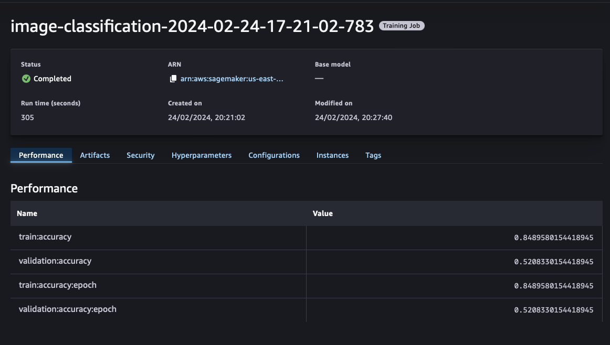

# nd009t-c2-CIFAR-project-submission

## Background
The project files in this repository represent the artifacts collected during the training and configuration of a ML workflow for Scones Unlimited on Amazon SageMaker. The `starter.ipynb` contains the source code used to perfom ETL, EDA, Training the Image Classification Algo, Model Deployment and finally Monitoring.

## Major Milestones Completed

### 1. ETL

The CIFAR file format may initially seem like a complex dataset with index mappings between the `image_dataset` (training) and `meta_data` (labels). However it becomes relatively easy to manipulate with the already learned skills of EDA and some understanding of multi-dimentional arrays. Once the image data can be parsed and uploaded to an s3 bucket, the rest of the training and deployment process fall in line.  

### 2. Training Image Classifier

Image below shows a successful training job (n=1000 images) and the performance. 

### 3. Deployment
Image below shows the model endpoint against which predictions can be made. 

### 4. ML Workflow (Lamba and Stepfunctions)
Design Time 

Execution Results

### 5. Monitor

