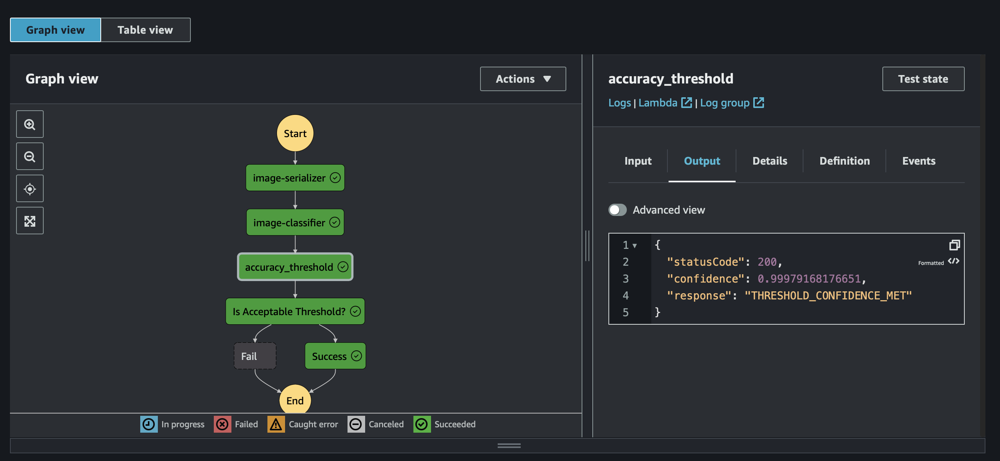

# nd009t-c2-CIFAR-project-submission

## Background
The project files in this repository represent the artifacts collected during the training and configuration of a ML workflow for Scones Unlimited on Amazon SageMaker. The `starter.ipynb` contains the source code used to perfom ETL, EDA, Training the Image Classification Algo, Model Deployment and finally Monitoring.


## Major Milestones Completed

### 1. ETL

The CIFAR file format may initially seem like a complex dataset with index mappings between the `image_dataset` (training) and `meta_data` (labels). However it becomes relatively easy to manipulate with the already learned skills of EDA and some understanding of multi-dimentional arrays. Once the image data can be parsed and uploaded to an s3 bucket, the rest of the training and deployment process fall in line.  

### 2. Training Image Classifier

Image below shows a successful training job (n=1000 images).


### 3. Deployment
Image below shows the model endpoint against which predictions can be made. 


### 4. ML Workflow (Lamba and Stepfunctions)
Design Time 


Execution Results


### 5. Monitoring and Visualisations


## Noteworthy Customisations

1. Support parallel image inputs
The initial `image-serializer` lamba payload is modified to support passing arrays of test images objects. The output of the serializer is stored in a special s3 bucket in form of a JsonString or other datastructure. This would be preferred to avoid exceed payload limits between step functions.

The `image-classifier` lambda is configured to trigger once new objects are `PUT` in that special folder. The classifer creates a transform job to run and passing the s3 bucket uri as the input data and also defines an outpath for the predictions. The predictions can be stored in csv format. 

Finally, the `accuracy_threadhold` lambda is configured to trigger once new csv are `PUT` in the same output folder passed to the batch transform job. The function pulls the csv file and evaluates the pass/fail for each for each prediction. At this point, the result can still be stored in a special s3 bucket, or sent to the `sns` for final handling. 


2. Notifications on lambda errors
Add try/except idioms on all critical transactions in the lambda_handler to push events/notifications to 'sns' topics. 

An example of that script is shown below; 

``` python
sns_client.publish (
    TopicArn='arn:aws:sns:us-east-1:733710257842:project_model_worflow_error.fifo',
    Message=f'Unhandled Exception: {str(e)}',
    MessageGroupId='1',
    MessageDeduplicationId='1',
    Subject='LambdaErrorAlert'
)
```
